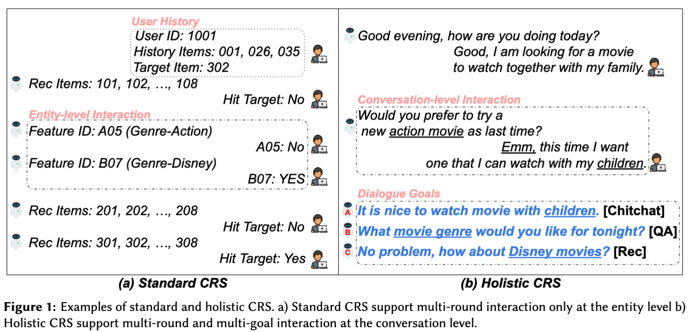

[//]:<!the template comes from this repo: https://github.com/teacherpeterpan/Question-Generation-Paper-List>

# CRS-Paper-List
In this repository, we summarise a paper list of works in conversational recommendation systems and their related areas.

- Contributed by **[Victor Li](https://lichuangnus.github.io/)** and collaboration is welcome.
- Our [survey paper on holistic CRS](https://arxiv.org/abs/2309.07682) has been accepted to the [KaRS Workshop](https://kars-workshop.github.io/2023/about/), RecSys 2023, Singapore. 
- Please follow [this link](./README_by_year.md) to view papers chronologically. 

## [Content](#content)

<table align="left">
<tr><td colspan="2"><a href="#survey-papers">1. Survey</a></td></tr> 
    
<tr><td colspan="2"><a href="#lm-based-holitic-crs-methods">2.Holistic CRS Models</a></td></tr> 
    
<tr>
    <td>&emsp;<a href="#lm-based-holitic-crs-methods">2.1 Language Model-based Holistic CRS</a></td>
</tr>
<tr>
     <td>&emsp;<a href="#knowledge-enhanced-holistic-crs-models">2.2 Knowledge-enhanced Holitic CRS</a></td>
</tr>
<tr>
     <td>&emsp;<a href="#external-guidance-in-holistic-crs-methods">2.3 External Guidance in Holistic CRS</a></td>
</tr> 
<tr><td colspan="2"><a href="#simulation-based-crs-models">3. Standard CRS Models</a></td></tr> 
    
    
<tr><td colspan="2"><a href="#resources">4. Resources</a></td></tr>
<tr>
    <td>&emsp;<a href="#crs-datasets">4.1 CRS Datasets</a></td>
</tr>
<tr>
     <td>&emsp;<a href="#crs-libraries">4.2 CRS Libraries</a></td>
</tr>
</table>

## [Survey papers](#content)

**A Conversation is Worth A Thousand Recommendations: A Survey of Holistic Conversational Recommender Systems** 2023. [Paper](https://arxiv.org/pdf/2309.07682.pdf)
  *Chuang Li, Hengchang Hu, Yan Zhang, Min-Yen Kan, Haizhou Li*

 **Deep Conversational Recommender Systems: A New Frontier for Goal-Oriented Dialogue Systems.** 2020. [Paper](https://arxiv.org/pdf/2004.13245.pdf)

  *Dai Hoang Tran, Quan Z. Sheng, Wei Emma Zhang et al*
   
    
 **A survey on conversational recommender systems.** ACM, 2020. [Paper](https://arxiv.org/pdf/2004.00646.pdf)

  *Dietmar Jannach, Ahtsham Manzoor, Wanling Cai, Li Chen*
    
 **Advances and Challenges in Conversational Recommender Systems: A Survey.** 2021. [Paper](https://arxiv.org/pdf/2101.09459.pdf)

   *Gao Chongming, Wenqiang Lei, Xiangnan He, Maarten de Rijke, and Tat-Seng Chua.*
    
 **Conversational Recommendation: Formulation, Methods, and Evaluation** SIGIR, Tutorial, 2020. [Slide](http://staff.ustc.edu.cn/~hexn/slides/sigir20-tutorial-CRS-slides.pdf)

   *Wenqing Lei, Xiangnan He, Maarten de Rijke, Tat-Seng Chua*
    

### [LM-based Holitic CRS Methods](#content)

**Towards Conversation Recommender Systems**. 2018.  [Paper](https://dl.acm.org/doi/10.1145/2939672.2939746)

  *Konstantina Christakopoulou, Filip Radlinski, Katja Hofmann*
  
 **Conversational Recommender System**. 2018, SIGIR. [Paper](https://arxiv.org/pdf/1806.03277)

  *Yueming Sun, Yi Zhang*

**Towards Deep Conversational Recommendations**. 2018 [Paper](https://arxiv.org/abs/1812.07617)

*Raymond Li, Samira Kahou, Hannes Schulz, Vincent Michalski, Laurent Charlin, Chris Pal*

**Deep conversational recommendation in travel**. 2019  [Paper](https://arxiv.org/abs/1907.00710)

  *Lizi Liao, Ryuichi Takanobu, Yunshan Ma, Xun Yang, Minlie Huang, Tat-Seng Chua*

 **What does BERT know about books, movies and music? Probing BERT for Conversational Recommendation**. 2020 [Paper](https://arxiv.org/abs/2007.15356)
 
  *Gustavo Penha, Claudia Hauff*

**INSPIRED: Toward Sociable Recommendation Dialog Systems**. 2020   [Paper](https://aclanthology.org/2020.emnlp-main.654/)

  *Shirley Anugrah Hayati, Dongyeop Kang, Qingxiaoyang Zhu, Weiyan Shi, Zhou Yu*
  
**INSPIRED2: An Improved Dataset for Sociable Conversational Recommendation**. 2022 [Paper](https://arxiv.org/abs/2208.04104)

  *Ahtsham Manzoor, Dietmar Jannach*
  
**A Unified Multi-task Learning Framework for Multi-goal Conversational Recommender Systems**. 2022  [Paper](https://arxiv.org/abs/2204.06923)

  *Yang Deng, Wenxuan Zhang, Weiwen Xu, Wenqiang Lei, Tat-Seng Chua, Wai Lam*
  
**Zero-Shot Prompting for Implicit Intent Prediction and Recommendation with Commonsense Reasoning**. 2023 [Paper](https://arxiv.org/abs/2210.05901)
 
  *Hui-Chi Kuo, Yun-Nung Chen*
  
 **Conversational Recommender System**. 2018, SIGIR. [Paper](https://arxiv.org/pdf/1806.03277)

  *Yueming Sun, Yi Zhang*
  

## [Knowledge-enhanced Holistic CRS Models](#content)

**LATTE: A Framework for Learning Item-Features to Make a Domain-Expert for Effective Conversational Recommendation** 2023 [Paper](https://dl.acm.org/doi/10.1145/3580305.3599401)
 *Taeho Kim, Juwon Yu, Won-Yong Shin, Hyunyoung Lee, Ji-hui Im, Sang-Wook Kim*

 **Towards Unified Conversational Recommender Systems via Knowledge-Enhanced Prompt Learning**. 2022  [Paper](https://arxiv.org/abs/2206.09363)

  *Xiaolei Wang, Kun Zhou, Ji-Rong Wen, Wayne Xin Zhao*
  
**TREA: Tree-structure Reasoning Schema for Conversational Recommendation**. 2023 [Paper](https://aclanthology.org/2023.acl-long.167/)

  *Wendi Li, Wei Wei, Xiaoye Qu, Xian-Ling Mao, Ye Yuan, Wenfeng Xie, Dangyang Chen*
  
  **Variational Reasoning over Incomplete Knowledge Graphs for Conversational Recommendation**. 2022 [Paper](https://arxiv.org/abs/2212.11868)
  
  *Xiaoyu Zhang, Xin Xin, Dongdong Li, Wenxuan Liu, Pengjie Ren, Zhumin Chen, Jun Ma, Zhaochun Ren*

**Towards Knowledge-Based Recommender Dialog System**. ACL, 2019. [Paper](https://arxiv.org/pdf/1908.05391)
    
  *Qibin Chen, Junyang Lin et al*

**Improving conversational recommender systems via knowledge graph-based semantic fusion**.  2020 [paper](https://arxiv.org/abs/2007.04032)

 *Kun Zhou, Wayne Xin Zhao, Shuqing Bian, Yuanhang Zhou, Ji-Rong Wen, Jingsong Yu*

**KECRS: Towards Knowledge-Enriched Conversational Recommendation System**. 2021 [Paper](https://arxiv.org/abs/2105.08261)

  *Tong Zhang, Yong Liu, Peixiang Zhong, Chen Zhang, Hao Wang, Chunyan Miao*

**RevCore: Review-augmented Conversational Recommendation**. 2021   [Paper](https://arxiv.org/abs/2106.00957)

  *Yu Lu, Junwei Bao, Yan Song, Zichen Ma, Shuguang Cui, Youzheng Wu, Xiaodong He*

**Variational Reasoning about User Preferences for Conversational Recommendation**. 2022   [Paper](https://arxiv.org/abs/2212.11868)

  *Xiaoyu Zhang, Xin Xin, Dongdong Li, Wenxuan Liu, Pengjie Ren, Zhumin Chen, Jun Ma, Zhaochun Ren*

**CRFR: Improving Conversational Recommender Systems via Flexible Fragments Reasoning on Knowledge Graphs**. 2021  [Paper](https://aclanthology.org/2021.emnlp-main.355/)

  *Jinfeng Zhou, Bo Wang, Ruifang He, Yuexian Hou*

**RecInDial: A Unified Framework for Conversational Recommendation with Pretrained Language Models**. 2021   [Paper](https://arxiv.org/abs/2110.07477)

  *Lingzhi Wang, Huang Hu, Lei Sha, Can Xu, Kam-Fai Wong, Daxin Jiang*

**Knowledge-Grounded Dialogue Generation with a Unified Knowledge Representation**. 2021  [Paper](https://arxiv.org/abs/2112.07924)

  *Yu Li, Baolin Peng, Yelong Shen, Yi Mao, Lars Liden, Zhou Yu, Jianfeng Gao*
  
**Target-guided Knowledge-aware Recommendation Dialogue System: An Empirical Investigation**. 2021 [Paper](https://ceur-ws.org/Vol-2960/paper7.pdf)

  *Dongding Lin1, Jian Wang1 and Wenjie Li1*
  
**Recommendation as a Communication Game: Self-Supervised Bot-Play for Goal-oriented Dialogue**. 2019 [Paper](https://arxiv.org/abs/1909.03922)

  *Dongyeop Kang, Anusha Balakrishnan, Pararth Shah, Paul Crook, Y-Lan Boureau, Jason Weston*
  
**Towards Explainable Conversational Recommendation** ICJAI, 2020. [Paper](https://www.ijcai.org/proceedings/2020/0414.pdf)

  *Zhongxia Chen, Xiting Wang et al*
 
**CR-Walker: Tree-Structured Graph Reasoning and Dialog Acts for Conversational Recommendation**. 2021  [Paper](https://aclanthology.org/2021.emnlp-main.139/)

  *Wenchang Ma, Ryuichi Takanobu, Minlie Huang*
  
**OpenDialKG: Explainable Conversational Reasoning with Attention-based Walks over Knowledge Graphs**. 2019 [Paper](https://aclanthology.org/P19-1081/)

  *Seungwhan Moon, Pararth Shah, Anuj Kumar, Rajen Subba*

**Learning Neural Templates for Recommender Dialogue System**. 2021 [Paper](https://arxiv.org/abs/2109.12302)

  *Zujie Liang, Huang Hu, Can Xu, Jian Miao, Yingying He, Yining Chen, Xiubo Geng, Fan Liang, Daxin Jiang*
  

  

### [External Guidance in Holistic CRS Methods](#content)

**Towards Topic-Guided Conversational Recommender System**. 2020 [paper](https://aclanthology.org/2020.coling-main.365/)

 *Kun Zhou, Yuanhang Zhou, Wayne Xin Zhao, Xiaoke Wang, Ji-Rong Wen*

**Towards Conversational Recommendation over Multi-Type Dialogs**. 2020  [Paper](https://arxiv.org/abs/2005.03954)

  *Zeming Liu, Haifeng Wang, Zheng-Yu Niu, Hua Wu, Wanxiang Che, Ting Liu*
  

**C2-CRS: Coarse-to-Fine Contrastive Learning for Conversational Recommender System**. 2022  [Paper](https://arxiv.org/abs/2201.02732)

  *Yuanhang Zhou, Kun Zhou, Wayne Xin Zhao, Cheng Wang, Peng Jiang, He Hu*

**Improving Conversational Recommender System via Contextual and Time-Aware Modeling with Less Domain-Specific Knowledge**. 2022  [Paper](https://arxiv.org/abs/2209.11386)

  *Lingzhi Wang, Shafiq Joty, Wei Gao, Xingshan Zeng, Kam-Fai Wong*

**User-Centric Conversational Recommendation with Multi-Aspect User Modeling**. 2022 [Paper](https://arxiv.org/abs/2204.09263)

  *Shuokai Li, Ruobing Xie, Yongchun Zhu, Xiang Ao, Fuzhen Zhuang, Qing He*

**Graph-Grounded Goal Planning for Conversational Recommendation**. 2022 [Paper](https://ieeexplore.ieee.org/document/9699426)

  *Zeming Liu; Ding Zhou; Hao Liu; Haifeng Wang; Zheng-Yu Niu; Hua Wu; Wanxiang Che*

**Modeling Global and Local Interactions for Online Conversation Recommendation**. 2021 [Paper](https://dl.acm.org/doi/10.1145/3473970)
 
  *Xingshan Zeng, Jing Li, Lingzhi Wang, Kam-Fai Wong*

**Dynamic Online Conversation Recommendation**. 2020   [Paper](https://aclanthology.org/2020.acl-main.305/)

  *Xingshan Zeng, Jing Li, Lu Wang, Zhiming Mao, Kam-Fai Wong*

**Category Aware Explainable Conversational Recommendation**. 2021  [Paper](https://arxiv.org/abs/2103.08733)

  *Nikolaos Kondylidis, Jie Zou, Evangelos Kanoulas*
  
**Improving Conversational Recommender Systems via Transformer-based Sequential Modelling**. 2022 [Paper](https://dl.acm.org/doi/10.1145/3477495.3531852)

  *Jie Zou, Evangelos Kanoulas, Pengjie Ren, Zhaochun Ren, Aixin Sun, Cheng Long*

**Topic-guided conversational recommender in multiple domains**. 2020 [Paper](https://ieeexplore.ieee.org/document/9138776)

  *Lizi Liao, Ryuichi Takanobu, Yunshan Ma, Xun Yang, Minlie Huang, Tat-Seng Chua*
 
**User-memory reasoning for conversational Recommendation**. 2020  [Paper](https://arxiv.org/abs/2006.00184)

  *Hu Xu, Seungwhan Moon, Honglei Liu, Bing Liu, Pararth Shah, Bing Liu, Philip S. Yu*

**Improving Conversational Recommendation Systems’ Quality with Context-Aware Item Meta-Information**. 2021  [Paper](https://arxiv.org/abs/2112.08140)

  *Bowen Yang, Cong Han, Yu Li, Lei Zuo, Zhou Yu*
  

**Aligning Recommendation and Conversation via Dual Imitation**. 2022 [Paper](https://aclanthology.org/2022.emnlp-main.36/)

  *Jinfeng Zhou, Bo Wang, Minlie Huang, Dongming Zhao, Kun Huang, Ruifang He, Yuexian Hou*
  

   **"It doesn't look good for a date": Transforming Critiques into Preferences for Conversational Recommendation Systems**. 2021 [Paper](http://arxiv.org/abs/2109.07576)
   
   *Victor S. Bursztyn1, Jennifer Healey2, Nedim Lipka2, Eunyee Koh2, Doug Downey1,3, and Larry Birnbaum1*
   
 
    
  **Evaluating Conversational Recommender Systems via User Simulation** ACM, 2020. [Paper](https://arxiv.org/pdf/2006.08732.pdf)

  *Shuo Zhang and Krisztian Balog*

## [Simulation-based CRS Models](#content)

 **Estimation-Action-Reflection: Towards Deep Interaction Between Conversational and Recommender Systems** ACM, 2020. [Paper](https://arxiv.org/pdf/2002.09102.pdf)

  *Wenqiang Lei, Xiangnan He, Yisong Miao et al*

 **Interactive Path Reasoning on Graph for Conversational Recommendation** ACM, 2020. [Paper](https://arxiv.org/pdf/2007.00194)

  *Wenqiang Lei, Gangyi Zhang, Xiangnan He and Yisong Miao et al*

 **Towards Conversational Search and Recommendation: System Ask, User Respond** CIKM, 2018. [Paper](http://yongfeng.me/attach/conv-search-rec-zhang2018.pdf)

  *Zhang, Yongfeng and Chen, Xu et al*

  **User Memory Reasoning for Conversational Recommendation** ICCL, 2020. [Paper](https://arxiv.org/pdf/2006.00184)

   *Hu Xu, Seungwhan Moon, Honglei Liu et al*
   
  **Dynamic Online Conversation Recommendaiton** ACL, 2020. [Paper](https://aclanthology.org/2020.acl-main.305.pdf)

  *Zeng, Xingshan and Li, Jing et al*

 
 **Preference Elicitation Strategy for Conversational Recommender System** ACM, 2019. [Paper](https://dl.acm.org/doi/abs/10.1145/3289600.3291604)

 *Bilih Priyogi*

 
 **Task-Oriented Dialog Systems that Consider Multiple Appropriate Responses under the Same Contex.** AAAI, 2019. [Paper](https://arxiv.org/pdf/1911.10484.pdf)

 *Yichi Zhang, Zhijian Ou and Zhou Yu*

 **Q&R: A Two-Stage Approach toward Interactive Recommendation** KDD, 2018. [Paper](https://dl-acm-org.libproxy1.nus.edu.sg/doi/pdf/10.1145/3219819.3219894)

 *Konstantina Christakopoulou, Alex Beutel, Rui Li, Sagar Jain, Ed H. Chi*

## [Resources](#content)

### [CRS Datasets](#content)

 **Restraurant review critique data: <"It doesn't look good for a date": Transforming Critiques into Preferences for Conversational Recommendation Systems>** [Source](https://github.com/vbursztyn/critique-to-preference-emnlp2021)
 
 **INSPIRED movie dataset: <INSPIRED: Toward Sociable Recommendation Dialog Systems>**[Source](https://aclanthology.org/2020.emnlp-main.654.pdf)
 
    
 **GoRecDial <Recommendation as a Communication Game:Self-Supervised Bot-Play for Goal-oriented Dialogue>**[Source](https://aclanthology.org/D19-1203.pdf)
 
 **ReDial <Towards Deep Conversational Recommendations>**[Source](https://papers.nips.cc/paper/2018/hash/800de15c79c8d840f4e78d3af937d4d4-Abstract.html)
 
 **DuRecDial**
 
 ### [CRS Libraries](#content)
 
  **CRSLab** is an open-source toolkit for building Conversational Recommender System (CRS)[Source](https://github.com/RUCAIBox/CRSLab)
 
  **Transformers4Rec** is a flexible and efficient library for sequential and session-based recommendation and can work with PyTorch.[Source](https://github.com/NVIDIA-Merlin/Transformers4Rec)
